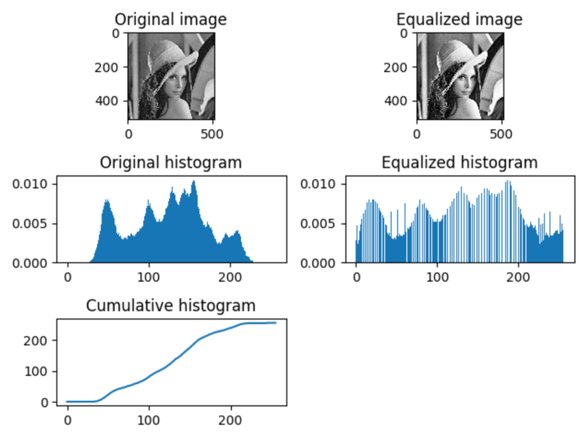
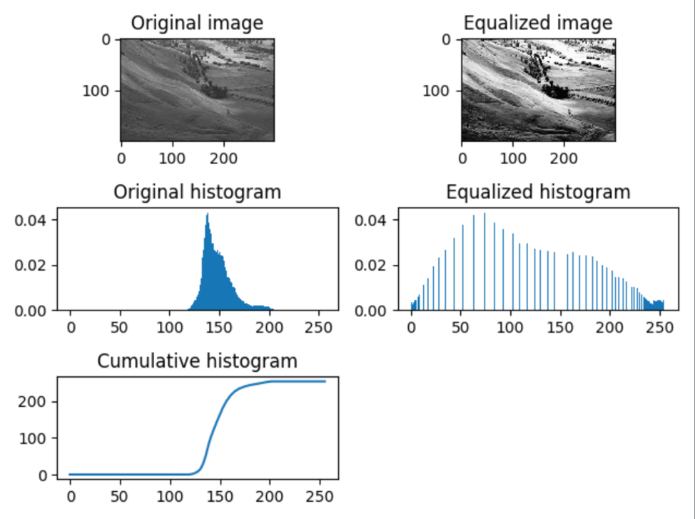
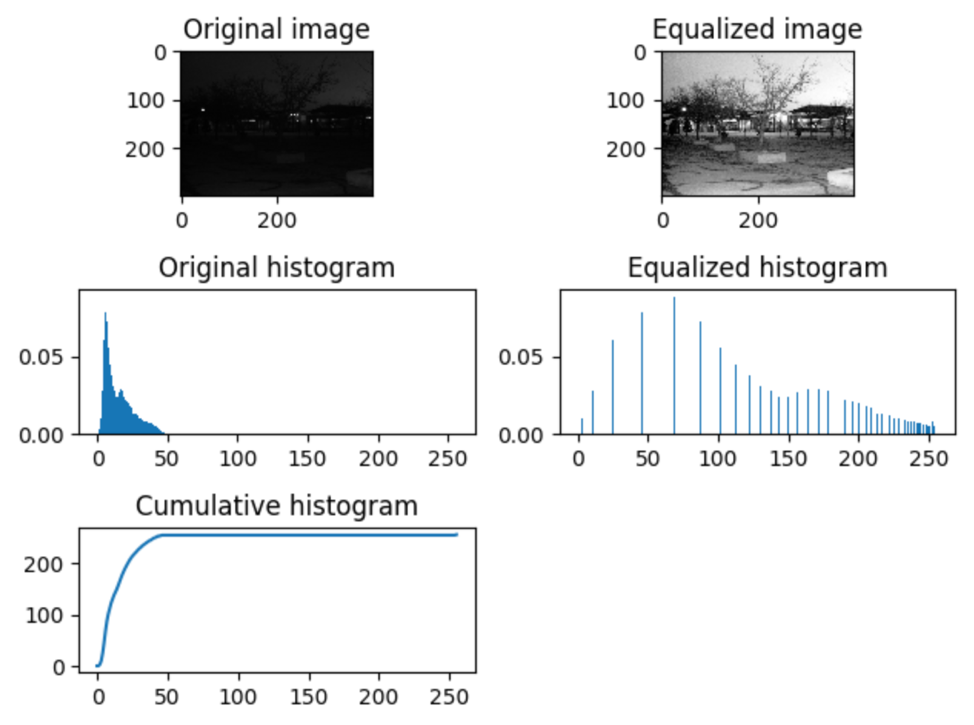

## Part #1 - Histogram equalization
 

The histogram equalization can adjust the contrast of an image by modifying the intensity distribution of the histogram. It takes three steps to calculate the histogram equalization.

 First, compute the histogram of the image

```python
def image_hist(image):
    m, n = image.shape
    h = [0.0] * 256
    for i in range(m):
        for j in range(n):
            value = int(image[i, j])
            h[value] += 1
    return np.array(h) / (m * n)
```
  
 Second, calculate the normalized sum of histogram

```python
def cumsum(h):
    return [sum(h[:i + 1]) for i in range(len(h))]
```

 Third, transform the input image to an output image

```
def hist_equalization(image):
    h = image_hist(image)
    cdf = np.array(cumsum(h))
    cdf_normalized = np.uint8(255 * cdf)
    m, n = image.shape
    dst = np.zeros_like(image)
    for i in range(m):
        for j in range(0, n):
            value = int(image[i, j])
            dst[i, j] = cdf_normalized[value]
    return dst
```

#### The effect of histogram equalization is as follows:

Example 1:



Example 2:



Example 3:


