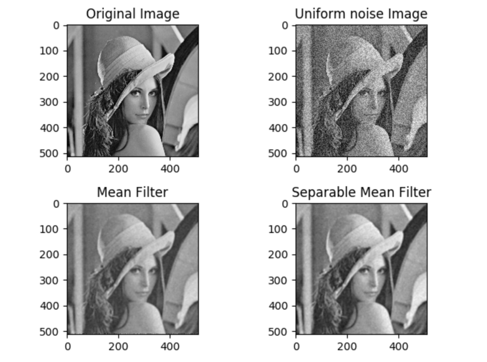
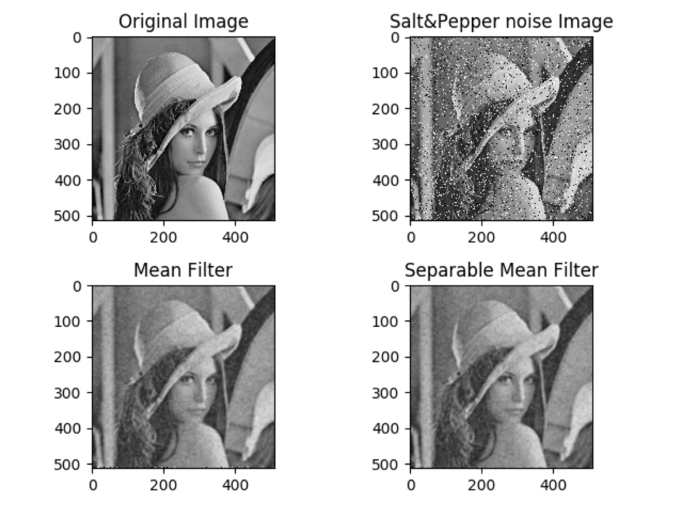
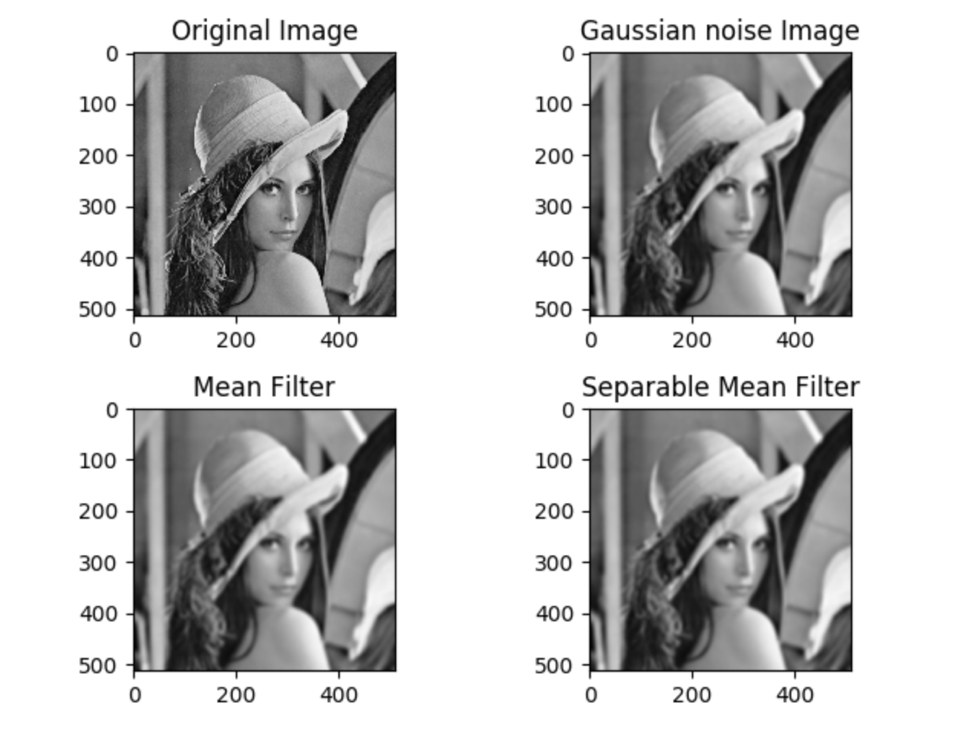

## Part #2 - Separable filters
#### Two versions of mean filter are implemented to smooth the images. The first version use basic 2D convolution. The second version use separable filters (1x7 and 7x1). 

The image convolution calculation code is computed as follows:

```python
def image_convolution(kernel, image):
    dst = np.copy(image)
    row, col = image.shape
    m, n = kernel.shape
    wr = math.floor(m / 2)
    wc = math.floor(n / 2)
    for i in range(wr, row - wr):
        for j in range(wc, col - wc):
            sum = 0
            for k in range(m):
                for g in range(n):
                    a = i - wr + k
                    b = j - wc + g
                    sum += image[a, b] * kernel[k, g]
            dst[i][j] = sum
    return dst
```

Apply mean filter to convolve the image with W = 3 (size = 7):

```python
size = 7
mean_kernel = np.mat(np.ones(shape=(size,size), dtype=float)) / (size * size)
smoothed_image = image_convolution(mean_kernel, noise_image)
```

Apply separable filters by separating a 2D filter into two 1D filters:

```python
size = 7
separable_kernel_1 = np.mat(np.ones(shape=(1, size), dtype=float)) / size
separable_kernel_2 = np.mat(np.ones(shape=(size, 1), dtype=float)) / size
intermidiate_noise_image = image_convolution(separable_kernel_1, noise_image)
smoothed_image = image_convolution(separable_kernel_2, intermidiate_noise_image)
```

Calculate the number of pixel differences between two images:

```python
def calculate_number_of_diff_pixel(image1, image2, margin):
    n = 0
    width, height = image1.shape
    for i in range(margin, height - margin):
        for j in range(margin, width - margin):
            if abs(image1[i][j] - image2[i][j]) > 0.0000001:
                n += 1
    print("Number of pixel differences: ", n)
```

To sum up, there was no difference between those two kind of pictures after using mean filter and the separable filter. And Separating a 2D filter into two 1D filters can greatly speed convolution.

The following is the effect after smooth the noisy image.

#### 1. Smooth the image after adding the uniform noise:

<div align=center></div>

>The time cost by applying mean filter: 21.845s<br/>
>The time cost by applying separable filters: 7.301s

#### 2. Smooth the image after adding the salt&pepper noise:

<div align=center></div>

>The time cost by applying mean filter: 21.605s<br/>
>The time cost by applying separable filters: 8.085s

#### 3. Smooth the image after adding the gaussian noise:

<div align=center></div>

>The time cost by applying mean filter: 27.941s<br/>
>The time cost by applying separable filters: 9.428s

