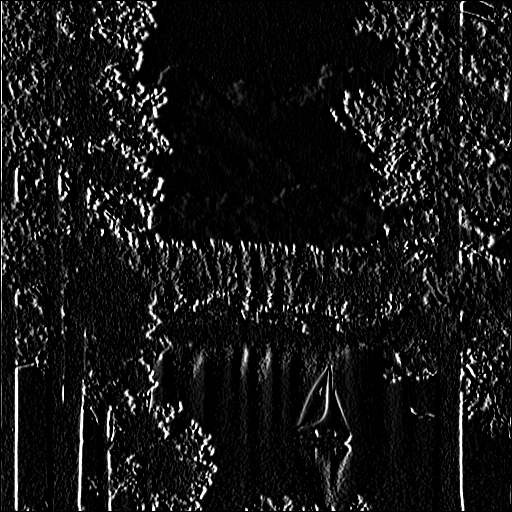
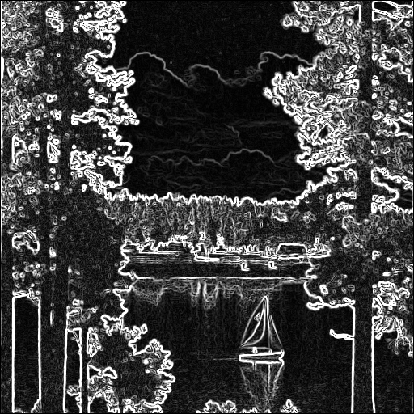

## Part #3 - Sobel filter
The Sobel operator is used in image processing and computer vision, particularly within edge detection algorithms where it creates an image emphasising edges.

The operator uses two 3x3 kernels which are convolved with the original image to claculate approximations of the derivatives – one for horizontal changes, and one for vertical. If we define A as the source image, and Gx and Gy are two images which at each point contain the vertical and horizontal derivative approximations respectively, the computations are as follows:

In the x direction:

$$
G_x=
\left\{
\begin{array}
\   -1 & 0 & 1
\\\\-2 & 0 & 2
\\\\-1 & 0 & 1
\end{array}
\right\}
 * A
$$

In the y direction:

$$
G_y=
\left\{
\begin{array}
\  -1 &-2 &-1
\\\\0 &0 &0
\\\\1 &2 &1
\end{array}
\right\} 
* A
$$

Edge detection by using Sobel filter:

<div align=center width="600">


<table style="width:100%;border:none;text-align: center;" >
<tr style="border:none"><td style="border:none;width:45%">In the x direction</td><td style="border:none;width:45%;">In the y direction</td></tr></table>
</div>

At each point in the image, the resulting gradient approximations can be combined to give the gradient magnitude, using:

$$
\left|grad(I[r,c])\right| = \begin{align*} 
\sqrt{
\left( \frac{\partial I}{\partial r} \right) ^2 + 
\left( \frac{\partial I}{\partial c} \right)^2 } \end{align*}
$$

The Sobel filter algorithm is as follows:

```python
Kx = np.array([[-1, 0, 1], [-2, 0, 2], [-1, 0, 1]], np.float32)
Ky = np.array([[1, 2, 1], [0, 0, 0], [-1, -2, -1]], np.float32)

Ix = image_convolution(Kx, raw_image, opt=True)
Iy = image_convolution(Ky, raw_image, opt=True)

sobel_image = np.zeros_like(Ix, dtype=float)
row, col = Ix.shape
for i in range(row):
    for j in range(col):
        sobel_image[i][j] = np.sqrt(Ix[i][j]**2 + Iy[i][j]**2)
sobel_image = sobel_image / sobel_image.max() * 255
```

<div align=center width="600">


<table style="width:100%;border:none;text-align: center;" >
<tr style="border:none"><td style="border:none;width:45%">The original image</td><td style="border:none;width:45%;">The final image</td></tr></table>
</div>

Other examples:

<div align=center width="600">


<table style="width:100%;border:none;text-align: center;" >
<tr style="border:none"><td style="border:none;width:45%">In the x direction</td><td style="border:none;width:45%;">In the y direction</td></tr></table>
</div>

<div align=center width="600">


<table style="width:100%;border:none;text-align: center;" >
<tr style="border:none"><td style="border:none;width:45%">The original image</td><td style="border:none;width:45%;">The final image</td></tr></table>
</div>

====

<div align=center width="600">


<table style="width:100%;border:none;text-align: center;" >
<tr style="border:none"><td style="border:none;width:45%">In the x direction</td><td style="border:none;width:45%;">In the y direction</td></tr></table>
</div>

<div align=center width="600">


<table style="width:100%;border:none;text-align: center;" >
<tr style="border:none"><td style="border:none;width:45%">The original image</td><td style="border:none;width:45%;">The final image</td></tr></table>
</div>

## Reference
1. [Wikipedia](https://en.wikipedia.org/wiki/Canny_edge_detector)
2. [OpenCV](https://docs.opencv.org/trunk/da/d22/tutorial_py_canny.html)