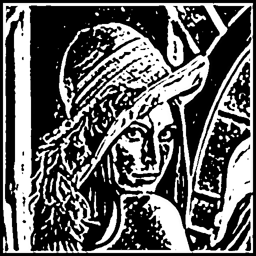
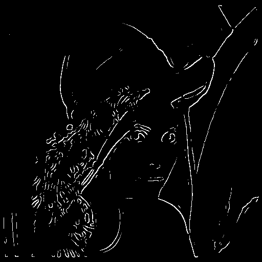
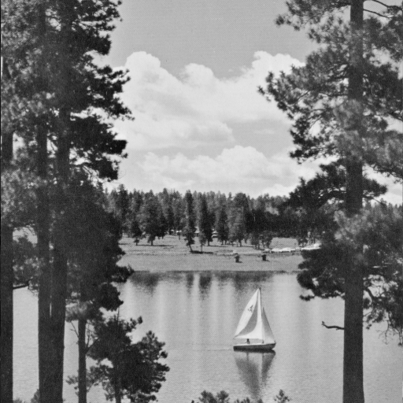
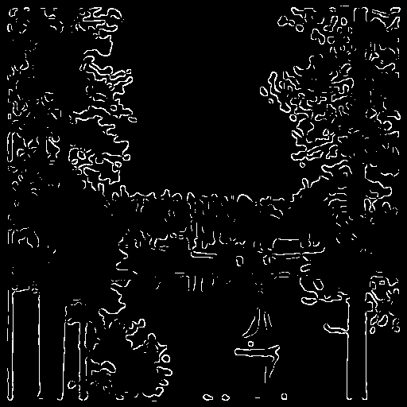
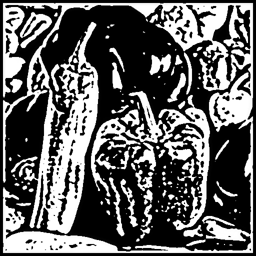
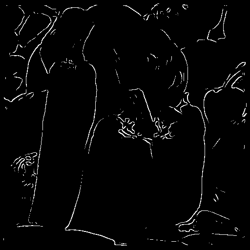

# Part #4 Marr-Hildreth Edge Detector

The Marr-Hildreth algorithm is a method of detecing edges in digital images, that is, continuous curves where there are strong and rapid variations in image britness. David Marr and Ellen C.Hildreth are two of the inventors (1980).

### The Laplacian of Gaussian(LoG)
The Marr-Hildreth edge detection method operates by convolving the image with the Laplacian of the Gaussian function. 

Gaussian Filter:

$$
f[dr,dc] = \frac{1}{2\pi\sigma^2}e^{\frac{dr^2+dc^2}{-2\sigma^2}}
$$

The Laplacian operator on Gaussian-smoothed data:

$$
\nabla^2[I[r,c]*f[dr,dc]]
$$

Laplacian and convolution are associative:

$$
\nabla^2I= \frac{\partial^2 I}{\partial r^2} + \frac{\partial^2 I}{\partial c^2}
$$

Therefore, Apply the Laplacian for a Gaussian-filtered image can be done in one step of convolution:

$$
LoG = \frac{1}{2\pi\sigma^2} 
\left(   
\frac{dr^2+dc^2-2\sigma^2}{\sigma^4}
\right)
e^{\frac{dr^2+dc^2}{-2\sigma^2}}
$$

The algorithm for the LoG kernel is as follows:

```python
def log_kernel(size, sigma):
    normal = 1 / (2.0 * np.pi * sigma ** 2)
    kernel = np.zeros(shape=(size, size), dtype=float)
    for i in range(size):
        for j in range(size):
            r = i - size // 2
            c = j - size // 2
            coeffi2 = (r ** 2 + c ** 2 - 2.0 * sigma ** 2) / (sigma ** 4)
            coeffi3 = np.exp(-1 * (r ** 2 + c ** 2) / (2.0 * sigma ** 2))
            kernel[i][j] = normal * coeffi2 * coeffi3
    return kernel
```

### Find zero-crossing and Apply threshold
After apply the LoG method, zero crossings are detected in the filtered result to obtain the edges.

+ A zero crossing at pixel p implies that the signs of at least two opposite neighboring pixels are different.
+ A pixel p is considered an edge pixel if any of the following conditions is true

```python
def is_diff_sign(a, b):
    if (a > 0 and b < 0) or (a < 0 and b > 0):
        return True
    return False

def is_zero_crossing(image, i, j, thres):
    if i >= 1 and j >= 1:
        v1 = is_diff_sign(image[i - 1][j - 1], image[i + 1][j + 1]) 
             and abs(image[i - 1][j - 1] - image[i + 1][j + 1]) > thres
        v2 = is_diff_sign(image[i - 1][j], image[i + 1][j]) 
             and abs(image[i - 1][j] - image[i + 1][j]) > thres
        v3 = is_diff_sign(image[i + 1][j - 1], image[i - 1][j + 1]) 
             and abs(image[i + 1][j - 1] - image[i - 1][j + 1]) > thres
        v4 = is_diff_sign(image[i][j - 1], image[i][j + 1]) 
             and abs(image[i][j - 1] - image[i][j + 1]) > thres
        if v1 or v2 or v3 or v4: return True
    return False
```

The Marr-Hildreth algorithm is as follows:

```python
def marr_hildreth(image, sigma):
    size = int(2 * (np.ceil(3 * sigma)) + 1)
    kernel = log_kernel(size, sigma)
    log_image = np.zeros(image.shape, dtype=float)

    row, col = image.shape
    m, n = kernel.shape
    wr = m // 2
    wc = n // 2
    for i in range(wr, row - wr):
        for j in range(wc, col - wc):
            window = image[i-wr:i+wr+1, j-wc:j+wc+1] * kernel
            log_image[i, j] = np.sum(window)

    log_image = log_image.astype(int, copy=False)
    ret_image = np.zeros_like(log_image)
    slop = np.abs(log_image).mean()
    for i in range(row - wr):
        for j in range(col - wc):
            if is_zero_crossing(log_image, i, j, slop):
                ret_image[i][j] = 255
    return log_image, ret_image
```

The rendering is shown below (σ=2):

<div align=center width="600">


<table style="width:100%;border:none;text-align: center;" >
<tr style="border:none"><td style="border:none;width:45%">The original image</td><td style="border:none;width:45%;">1. Smoothed by Gaussian Filter</td></tr></table>
</div>

<div align=center width="600">


<table style="width:100%;border:none;text-align: center;" >
<tr style="border:none"><td style="border:none;width:45%">2. Laplacian of Gaussian</td><td style="border:none;width:45%;">3. Zero-crossings</td></tr></table>
</div>

====

<div align=center width="600">


<table style="width:100%;border:none;text-align: center;" >
<tr style="border:none"><td style="border:none;width:45%">The original image</td><td style="border:none;width:45%;">1. Smoothed by Gaussian Filter</td></tr></table>
</div>

<div align=center width="600">


<table style="width:100%;border:none;text-align: center;" >
<tr style="border:none"><td style="border:none;width:45%">2. Laplacian of Gaussian</td><td style="border:none;width:45%;">3. Zero-crossings</td></tr></table>
</div>

====

<div align=center width="600">


<table style="width:100%;border:none;text-align: center;" >
<tr style="border:none"><td style="border:none;width:45%">The original image</td><td style="border:none;width:45%;">1. Smoothed by Gaussian Filter</td></tr></table>
</div>

<div align=center width="600">


<table style="width:100%;border:none;text-align: center;" >
<tr style="border:none"><td style="border:none;width:45%">2. Laplacian of Gaussian</td><td style="border:none;width:45%;">3. Zero-crossings</td></tr></table>
</div>

## Reference
1. [Wikipedia](https://en.wikipedia.org/wiki/Canny_edge_detector)
2. [OpenCV](https://docs.opencv.org/trunk/da/d22/tutorial_py_canny.html)