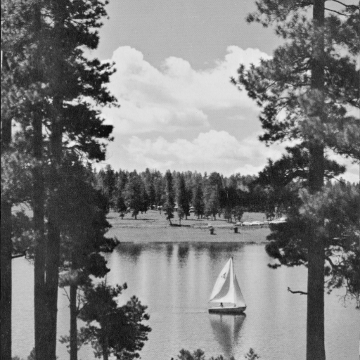
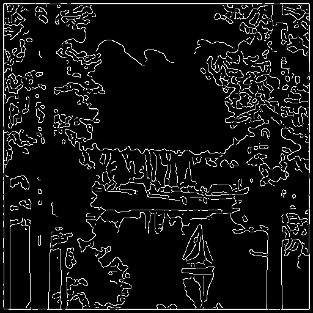

# Part #5 - Canny Edge Detector
Canny edge detection is a multi-step algorithm that can detect edges with noise supressed at the same time. It was developed by John F.Canny in 1986.

## Canny Edge Detector Steps

### Step 1: Noise reduction with Gaussian filter
Since all edge detection results are easily affected by image noise, it is essential to filter out hte noise to prevent false detection caused by noise. To smooth the image , a Gaussian filter is applied to convolve with the image. This step will slightly smooth the image to reduce the effects of obvious noise on the edge detector.

$$
f[dr,dc] = \frac{1}{2\pi\sigma^2}e^{\frac{dr^2+dc^2}{-2\sigma^2}}
$$

### Step 2: Finding Intensity Gradient of the Image
An edge is an image may point in a variety of directions, so the canny algorithm uses four filters to detect horizontal vertical and diagonal edges in the blurred image. The edge detection operator(such as Roberts, Prewitt, or Sobel) returns a value for the first derivative in the horizontal direction($G_x$) and the vertical direction($G_y$). The Sobel filter is used as follows:

In the x direction:

$$
G_x=
\left\{
\begin{array}
\   -1 & 0 & 1
\\\\-2 & 0 & 2
\\\\-1 & 0 & 1
\end{array}
\right\}
 * A
$$

In the y direction:

$$
G_y=
\left\{
\begin{array}
\  -1 &-2 &-1
\\\\0 &0 &0
\\\\1 &2 &1
\end{array}
\right\} 
* A
$$

From this the edge fradient and direction can be determined:

$$
Gradient(G) = \sqrt{G_x^2+G_y^2}
$$

$$
Angle(\theta) = tan^{-1} \left( \frac{G_y}{G_x} \right)
$$


### Step 3: Non-maximum suppression
Non-maximum suppression is applied to find "the largest" edge. After applying gradient calculation, the edge extracted from the gradient value is still quite blurred. There should only be one accurate response to the edge. Thus non-maximu suppression can help to suppress all the gradient values (by setting them to 0) except the local maxima, which indicate locations with the sharpest change of intensity value. The algorithm for each pixel in the gradient image is:

- 1. Compare the edge strength of the current pixel with the edge strength of the pixel in the positive and negative gradient directions.
- 2. If the edge strength of the current pixel is the largest compared to the other pixels in the mask with the same direction (e.g., a pixel that is pointing in the y-direction will be compared to the pixel above and below it in the vertical axis), the value will be preserved. Otherwise, the value will be suppressed.

```python
def nonmax_supression(image, angle):
    M, N = image.shape
    max_image = np.copy(image)
    angle = angle * 180.0 / np.pi
    for i in range(1, M - 1):
        for j in range(1, N - 1):
            if angle[i][j] < 0:
                angle[i][j] += 180.0
            degree = angle[i][j]
            # 0°
            if (0 <= degree < 22.5) or (157.5 <= degree < 180.):
                if image[i][j] < image[i][j-1] or image[i][j] < image[i][j+1]:
                    max_image[i][j] = 0
            # 45°
            elif 22.5 <= degree < 67.5:
                if image[i][j] < image[i+1][j-1] or image[i][j] < image[i-1][j+1]:
                    max_image[i][j] = 0
            # 90°
            elif 67.5 <= degree < 112.5:
                if image[i][j] < image[i + 1][j] or image[i][j] < image[i - 1][j]:
                    max_image[i][j] = 0
            # 135°
            elif 112.5 <= degree < 157.5:
                if image[i][j] < image[i-1][j-1] or image[i][j] < image[i+1][j+1]:
                    max_image[i][j] = 0
            else:
                pass
    return max_image
```


### Step 4: Double threshold
If an edge pixel’s gradient value is smaller than the high threshold value and larger than the low threshold value, it is marked as a weak edge pixel. If an edge pixel's value is smaller than the low threshold value, it will be suppressed.

```python
def double_threshold(img, lowThreshold=20, highThreshold=50):
    weak = 75
    strong = 255
    res = np.zeros_like(img, dtype=float)
    strong_i, strong_j = np.where(img >= highThreshold)
    # zeros_i, zeros_j = np.where(img < lowThreshold)
    weak_i, weak_j = np.where((img <= highThreshold) & (img >= lowThreshold))
    res[strong_i, strong_j] = strong
    res[weak_i, weak_j] = weak
    return res, weak, strong
```


#### Step 5: Track edge by Hysteresis
The strong edge pixels should certainly be involved in the final edge image, as they are extracted from the true edges in the image. 
Usually a weak edge pixel caused from edges will be connected to a strong edge pixel while noise reponses are unconnected. To track the edge connection, blob analysis is applied by looking at a weak edge pixel and its 8-connected neighborhood pixels. As long as there is one strong edge pixel that is involved in the blob, that weak edge point can be identified as one that should be preserved.

```python
def hysteresis(image, weak, strong=255):
    M, N = image.shape
    for i in range(1, M-1):
        for j in range(1, N-1):
            if image[i, j] == weak:
                if ((image[i+1, j-1] == strong) or (image[i+1, j] == strong) or (image[i+1, j+1] == strong)
                    or (image[i, j-1] == strong) or (image[i, j+1] == strong) or (image[i-1, j-1] == strong)
                        or (image[i-1, j] == strong) or (image[i-1, j+1] == strong)):
                    image[i, j] = strong
                else:
                    image[i, j] = 0
    return image
```

The rendering is shown below (σ=2):

<div align=center width="600">


<table style="width:100%;border:none;text-align: center;" >
<tr style="border:none"><td style="border:none;width:45%">The original image</td><td style="border:none;width:45%;">1. Gaussian Filter</td></tr></table>
</div>

<div align=center width="600">


<table style="width:100%;border:none;text-align: center;">
<tr style="border:none"><td style="border:none;width:45%">2. Gradient Magnitude</td><td style="border:none;width:45%;">3. Non-maximum Supression</td></tr></table>
</div>

<div align=center width="600">


<table style="width:100%;border:none;text-align: center;" >
<tr style="border:none"><td style="border:none;width:45%">4. Double Threshold</td><td style="border:none;width:45%;">5. Hysteresis</td></tr></table>
</div>

======

<div align=center width="600">


<table style="width:100%;border:none;text-align: center;" >
<tr style="border:none"><td style="border:none;width:45%">The original image</td><td style="border:none;width:45%;">1. Gaussian Filter</td></tr></table>
</div>

<div align=center width="600">


<table style="width:100%;border:none;text-align: center;">
<tr style="border:none"><td style="border:none;width:45%">2. Gradient Magnitude</td><td style="border:none;width:45%;">3. Non-maximum Supression</td></tr></table>
</div>

<div align=center width="600">


<table style="width:100%;border:none;text-align: center;" >
<tr style="border:none"><td style="border:none;width:45%">4. Double Threshold</td><td style="border:none;width:45%;">5. Hysteresis</td></tr></table>
</div>

======

<div align=center width="600">


<table style="width:100%;border:none;text-align: center;" >
<tr style="border:none"><td style="border:none;width:45%">The original image</td><td style="border:none;width:45%;">1. Gaussian Filter</td></tr></table>
</div>

<div align=center width="600">


<table style="width:100%;border:none;text-align: center;">
<tr style="border:none"><td style="border:none;width:45%">2. Gradient Magnitude</td><td style="border:none;width:45%;">3. Non-maximum Supression</td></tr></table>
</div>

<div align=center width="600">


<table style="width:100%;border:none;text-align: center;" >
<tr style="border:none"><td style="border:none;width:45%">4. Double Threshold</td><td style="border:none;width:45%;">5. Hysteresis</td></tr></table>
</div>
## Reference
1. [Wikipedia](https://en.wikipedia.org/wiki/Canny_edge_detector)
2. [OpenCV](https://docs.opencv.org/trunk/da/d22/tutorial_py_canny.html)